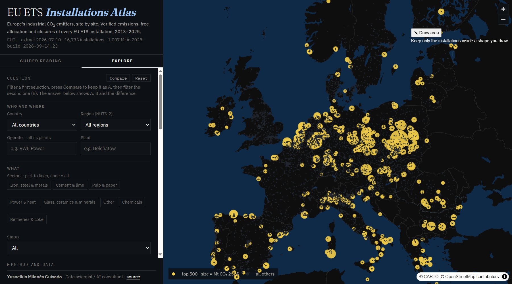
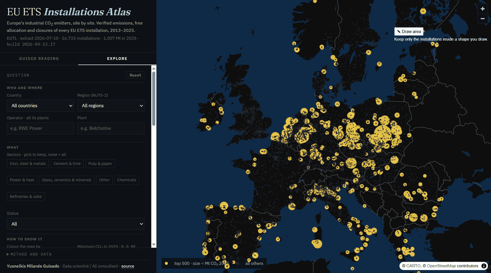

# EU ETS Installations Atlas

**Europe's industrial CO₂ emitters, site by site.** Every stationary installation in the EU Emissions Trading System on one map, with verified emissions 2013–2025, free allocation, closures, regional context and a one-page PDF report — built for policy analysts, and readable by anyone.

**Live:** https://yusnelkis.github.io/geodep-ets-map/



## What it answers

- *Where does Europe's industrial CO₂ come from?* 16,733 installations, 1,007 Mt in 2025; 500 sites carry 71.5 % of it.
- *Who operates what?* Search an operator and get all its plants; search a plant and get its operator, permit, activity and NACE code.
- *How is it changing?* −47 % since 2013 for the same installations; each site compared with its own 2021–2023 baseline.
- *What has really closed?* Closures counted only when the ETS permit is revoked — the 2020 "wave" is mostly the small-emitter opt-out and unexplained exits, not closures.
- *Who is still allocated for free, and for how long?* Free allocation vs emissions per year, with the CBAM phase-out (2026 → 2034) projected on the sectors it covers.
- *What does it mean for a region or a country?* Tonnes per inhabitant and per million euro of GDP by NUTS-2 region; ETS share of the national inventory.

## How it works

One screen, no server. A guided reading of eight short chapters moves the map; an Explore tab turns it into a tool:

| Explore | |
|---|---|
| Filters | country · NUTS-2 region · operator (all its plants) · plant · sectors (pick to keep) · status · minimum CO₂ · colour mode · **area drawn on the map**, analytics updating as you draw |
| Answer | installations, Mt CO₂ 2025 and share of the ETS; change vs baseline; free allocation and coverage; closures; regional or national context |
| Breakdown | sector · country · operators · over time · regions · allocation (emitted vs allocated 2021–25, CBAM phase-out to 2034) — click a bar to filter |
| Installation card | operator of record, address, ETS activity and code, NACE, permit; 2025 vs 2024; vs own baseline; allocation coverage and surplus or shortfall; timeline (first year, years reporting, revocation, exclusion); trajectory 2013–2025; rank in the ETS, in its country and sector; neighbours within 25 km |
| Compare | **Compare** freezes the current selection as A; whatever you filter next is B. The answer becomes a table A · B · B−A (installations, Mt, share of the ETS, change vs baseline, allocation and coverage, closures, per-capita, per-GDP or national share), the sector, country, operator and region bars pair up, the trajectory shows two lines, and A stays on the map as hollow rings. The comparison is part of the link and of the PDF. |
| Outputs | **Download CSV** of the selection (45 columns, tonne precision) · **Report (PDF)**: one page with filters, KPIs or the A/B table, map, breakdowns, largest sites and the open card · **Copy link**: every filter lives in the URL |

Colour has one meaning each: yellow is installations and their CO₂, blue is *down* or *closed*, red is *up*, sea blue is the pinned selection A, sector colours appear only when asked. Filtering by country, region or operator frames the map on the selection.



*Top 500 emitters · Poland by sector · iron and steel against its own baseline · Germany by free-allocation position. Each state is a URL.*

## Data and method

| Source | What is used | Version |
|---|---|---|
| EU Transaction Log (EUTL), public data download | installations, account holders, permits, verified emissions 2005–2025, free allocation, exclusion flag | extract 2026-07-10 |
| GISCO / Eurostat NUTS 2024 | NUTS-2 polygons (1:10M) for regional assignment | 2024 |
| Eurostat `nama_10r_2gdp`, `demo_r_pjanaggr3` | regional GDP (2023) and population (2024) | 2023 / 2024 |
| Eurostat `env_air_gge` | national GHG inventory, total excluding LULUCF (2023) | 2023 |
| ETS Directive art. 10a(1a), as amended by Directive (EU) 2023/959 | CBAM free-allocation phase-out factors 2026–2034 | current law |

Rules that shape every number on the page:

- **Join key** is registry code + installation identifier; the bare identifier repeats across countries.
- **−1 means "not reported"** and is treated as missing, never as zero (244,185 such rows).
- **Closure = revoked permit.** Of the 1,615 installations whose last emission year is 2020, only 430 were revoked; 386 were flagged excluded from 2021 (small-emitter opt-out); 799 left no reason. Read naively, 2020 looks like a wave of closures; it is mostly an administrative boundary.
- **Baseline** is each installation's mean over 2021–2023 (years with emissions above zero): a single year is noisy, and 2023 alone is the energy-crisis floor.
- **Tonne precision** in the data files; rounding happens only on display. Rounding to kilotonnes had silently turned 1,103 small emitters into "no emissions" — caught by the audit.
- **Regions**: point in polygon; coastal points left just offshore by the generalised coastline are attached to the nearest region within 5 km and flagged (222 cases). UK installations have no NUTS 2024 region. Nothing is estimated: a region without Eurostat data shows a dash.
- **One error, kept**: `GB_918` (INEOS CHP, Cleveland UK) is geocoded to Cleveland, Ohio — the kind of mistake a map catches and a table never does.

Every figure in the page comes from `docs/data/summary.json` and `docs/data/context.json`, produced by the scripts below. Nothing is typed by hand in the HTML.

## What it is not

Plants and **operators of record** (the ETS account holder, usually the operating subsidiary). No corporate groups, ultimate owners or GLEIF cross-references: that is a separate problem, addressed in the [GEODEP](https://github.com/Yusnelkis/geodep_setup) project, of which this atlas is a related but independent piece.

## Reproduce

```bash
python -m venv .venv && .venv/Scripts/activate           # Windows; use bin/activate elsewhere
pip install "duckdb==1.4.3" pyarrow
python code/build_extract.py       # EUTL -> data/ets_installations_2025.parquet (+ map layer parquet)
python code/build_context.py       # NUTS-2 + Eurostat -> data/nuts2_assignment.csv, docs/data/context.json
python code/build_site_data.py     # -> docs/data/installations.csv, docs/data/summary.json
python -m http.server 8765 --directory docs   # open http://localhost:8765
```

`build_extract.py` reads two public files from a sibling checkout of GEODEP (`GEODEP_SETUP_DIR`); the derived data are committed, so the page runs without them. External context files are listed in `data/ref/sources.json` (URL, licence, download date) and downloaded next to it.

Stack: DuckDB (all transformations, SQL in `sql/`), MapLibre GL + deck.gl (map), d3 (charts), plain HTML/CSS/JS, GitHub Pages. No build step, no framework, no tracking. The first exploration was done with the GeoSQL skill on a local Dekart server (see `docker/`), which is how the map-in-the-loop checks were run.

## Limits and next steps

- The data are a snapshot (EUTL extract of 2026-07-10); an update means re-running the three scripts.
- Regional context stops at NUTS-2; NUTS-3 and Just Transition Fund territories would be the next level.
- Free allocation is shown as totals; product benchmarks and the yearly allocation schedule are not modelled.
- Figures are for 2025. A year selector is built but parked: to ship it, status must be computed per year, the baseline and allocation rows shown only where they exist, and the control designed as a timeline under the answer rather than a dropdown.
- Planned: hotspot aggregation (hexagons of ~20 km) to read industrial clusters as systems.

## Credits and licence

Design and development: **Yusnelkis Milanés Guisado** · Data scientist / AI consultant.
Code under the MIT licence. Data files derive from the EU Transaction Log and Eurostat (public EU data, CC BY 4.0 for Eurostat) and keep their own terms. Basemap © CARTO, © OpenStreetMap contributors.
